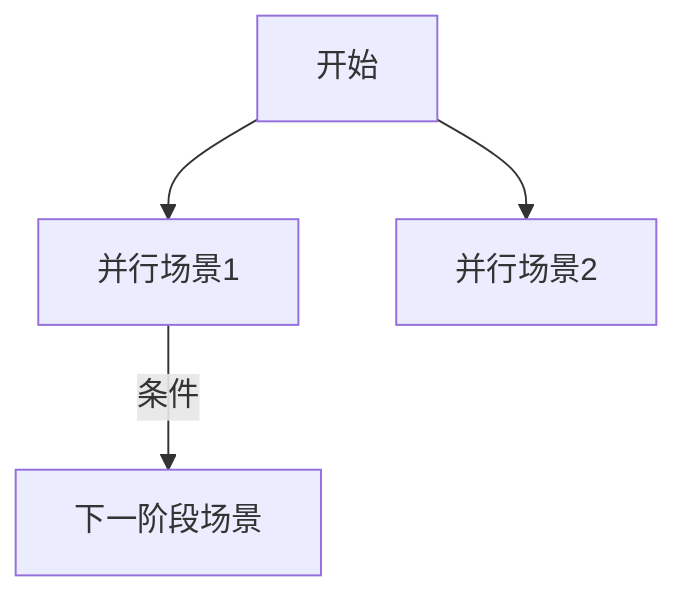

# 剧本改造快速提示词

直接复制以下内容，在末尾粘贴你的原始剧本，发送给大模型即可。

---

```
# 任务：将COC剧本拆分为结构化场景文件

## 你的角色
你是COC(克苏鲁的呼唤)剧本结构化专家，需要将完整剧本拆分成多个场景文件。

## 输出要求

### 1. 首先分析剧本结构

输出一个场景列表表格：
| 序号 | 场景名称 | 类型 | 阶段 | 前置条件 | 可发现线索 |
|------|----------|------|------|----------|------------|

场景类型说明：
- **并行**：可自由选择顺序的调查场景
- **条件**：特定行动触发（如"如果调查员试图攻击..."）
- **推进**：推动剧情到下一阶段
- **结局**：剧本结束

请遵循最小分割原则：能不分割的可以放在同一个场景（或主线剧本的）就不要分割。

### 2. 输出场景依赖关系图

使用Mermaid格式：


### 3. 输出配置文件 scenes.txt

格式：`场景名称:可进入次数`
```
场景名称1:1
场景名称2:1
可重复场景:2
```

### 4. 输出主线文件 主线.txt

包含：
- 开场背景
- 各阶段衔接文本
- 场景选择指令（格式见下方）
- 结局描述

场景选择指令格式：
```
剧情进行到此时调用"select_scene"mcp工具，输入参数scenes为下列场景名称，用空格隔开：
场景名1
场景名2
```

### 5. 输出每个场景文件

每个场景使用以下格式：

```
[场景名称]

=== 元数据 ===
【阶段】第X阶段
【类型】并行/条件/推进/结局
【前置】无 / 需完成XXX / 需发现线索XXX
【提醒】确保引导玩家进行主要事件（成功失败均可），同时玩家在该场景中可以自由探索，但是主持人生成的内容要完全基于该场景并且合理。

=== 场景内容 ===
[场景描述和主要事件，随着场景中发展应该进行的检定等操作，形成一个线性的结构]

=== 线索 ===
【线索名】描述（发现方式：XXX）

=== NPC ===
【名称】身份、态度、可提供信息

=== 分支 ===
如果调查员[行动]：调用"select_scene"mcp工具，输入参数scenes为"[场景名]"

=== 完成条件 ===
[核心调查完成的标志]

=== GM笔记 ===
[注意事项]
```

## 核心原则

1. **线性可控**：明确前置条件，防止跳跃
2. **自由探索**：同阶段场景可自由选择顺序
3. **线索驱动**：每个场景产出线索，线索指向后续内容
4. **条件分支**：玩家行动触发不同场景

## 命名规范

- 场景名简要
- 文件名：scene{阶段}（场景名）.txt

---

请分析以下剧本并按上述格式输出所有内容：

[在此粘贴你的原始剧本]
```

---

## 使用示例

将上述提示词复制后，在 `[在此粘贴你的原始剧本]` 处替换为你的剧本内容，然后发送给Claude/GPT-4等大模型。

模型会输出：
1. 场景分析表格
2. 依赖关系图
3. scenes.txt 内容
4. 开始-连接-结尾.txt 内容
5. 所有场景文件内容

你只需要将输出内容复制到对应的文件中即可。
