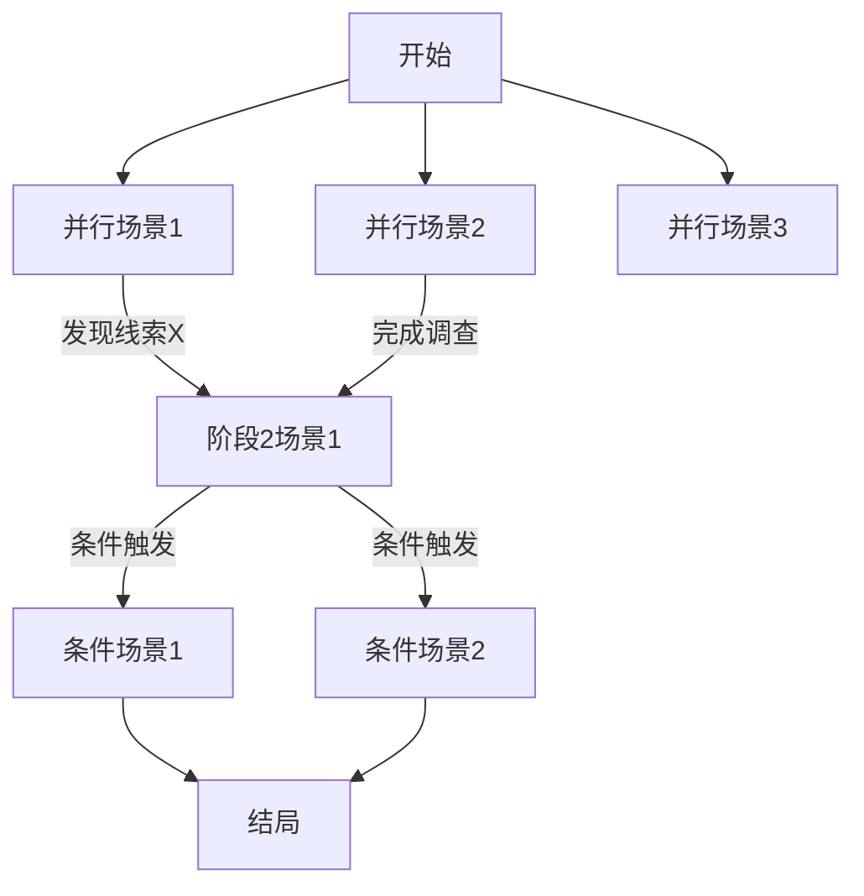

# COC剧本结构化改造指南

## 使用说明

将此提示词与你的原始剧本一起发送给大模型，让其按照规范输出结构化的场景文件。

---

## 提示词模板

```
你是一个专业的COC(克苏鲁的呼唤)剧本结构化专家。我需要你将一个完整的COC剧本拆分成符合我游戏系统的多个场景文件。

## 系统架构说明

我的游戏系统使用以下结构：
1. **主线文件** `开始-连接-结尾.txt` - 包含剧本的开场、章节衔接、结局
2. **场景文件** `scene{序号}（场景名）.txt` - 每个可进入的调查场景
3. **配置文件** `scenes.txt` - 场景名称与进入次数限制的映射

## 场景分类

请将剧本内容按以下类型分类：

### 类型A：并行调查场景
- 玩家可以自由选择顺序的场景
- 通常是初期调查阶段的多个地点/线索
- 示例：询问邻居、图书馆调查、查看报纸

### 类型B：条件触发场景
- 需要特定条件才能进入的场景
- 格式："如果调查员XXX"
- 示例：如果调查员试图攻击人影、如果调查员与NPC交谈

### 类型C：阶段推进场景
- 完成一组并行场景后才能进入的场景
- 代表剧情的重大推进
- 示例：第一阶段调查完成后的"监视"场景

### 类型D：结局场景
- 剧本的各种结局分支
- 通常在尾声阶段

## 输出格式要求

### 1. 主线文件 (开始-连接-结尾.txt)

```
# 开始调查
[开场背景描述，向玩家说明任务]

[当需要提供场景选择时，使用以下格式：]
剧情进行到此时调用"select_scene"mcp工具，输入参数scenes为下列场景名称，用空格隔开：
场景名称1
场景名称2
场景名称3

# 第X阶段衔接
[描述如何从上一阶段过渡到下一阶段]
[说明进入下一阶段的条件]

剧情进行到此时调用"select_scene"mcp工具...

# 尾声
[各种结局的描述]
[奖励说明]
```

### 2. 场景文件 (scene{N}（场景名）.txt)

每个场景文件应包含以下结构化元素：

```
[场景名称]

=== 场景信息 ===
【所属阶段】第X阶段
【场景类型】并行调查 / 条件触发 / 阶段推进
【前置条件】无 / 需完成场景XXX / 需发现线索XXX

=== 场景内容 ===
[场景的主体描述]

=== 可发现的线索 ===
【线索1名称】线索描述
【线索2名称】线索描述

=== 技能检定 ===
【检定1】侦查/追踪检定 - 成功后发现XXX
【检定2】力量检定 - 成功后可以XXX

=== NPC交互 ===
【NPC名称】
- 外观描述
- 可提供的信息
- 交互条件（如需要通过外貌检定）

=== 场景分支 ===
如果调查员[行动A]，调用"select_scene"mcp工具，输入参数scenes为"[目标场景名]"
如果调查员[行动B]，调用"select_scene"mcp工具，输入参数scenes为"[目标场景名]"

=== 场景完成标志 ===
当调查员[完成条件]时，视为完成本场景的核心调查。

=== 守秘人笔记 ===
[给GM的提示和注意事项]
```

### 3. 配置文件 (scenes.txt)

```
场景名称1:进入次数限制
场景名称2:进入次数限制
```

说明：
- 普通调查场景通常设为1
- 可重复进入的场景（如需要多次监视）设为2或更高
- 条件触发场景设为1

## 场景依赖关系图

请同时输出一个场景依赖关系的Mermaid图：



## 重要原则

1. **保持线性可控**
   - 明确标注每个场景的前置条件
   - 阶段性场景必须在前置场景完成后才能开放
   - 条件触发场景必须满足特定条件

2. **保持自由度**
   - 同一阶段内的并行场景可自由选择顺序
   - 不强制完成所有并行场景（但可设置最少完成数）
   - 允许玩家选择不同的调查方式

3. **防止跳跃**
   - 关键线索必须通过调查发现，不能凭空知道
   - 重要NPC必须先"遇见"才能"交谈"
   - 隐藏地点必须先"发现"才能"进入"

4. **线索驱动**
   - 每个场景都应该产出至少一条线索
   - 线索应该指向后续场景
   - 关键线索应该是进入下一阶段的前置条件

5. **场景命名规范**
   - 并行调查场景：动词+地点/对象（如"查看墓地周边"、"询问附近居民"）
   - 条件触发场景：以"如果调查员"开头（如"如果调查员试图攻击人影"）
   - 阶段推进场景：描述性名称（如"监视屋子或墓地"）

## 示例输出

现在请分析以下剧本，按上述格式输出：
1. 场景拆分方案（列出所有场景及其类型）
2. 场景依赖关系图（Mermaid格式）
3. scenes.txt 配置文件内容
4. 开始-连接-结尾.txt 文件内容
5. 每个场景文件的完整内容

---

[在此粘贴你的原始剧本]
```

---

## 补充说明

### 如何使用此提示词

1. 复制上方的提示词模板
2. 在末尾粘贴你的原始COC剧本
3. 发送给大模型（推荐使用Claude或GPT-4）
4. 审核输出结果，根据需要调整

### 输出后的检查清单

- [ ] 所有场景都有明确的前置条件
- [ ] 并行场景之间没有隐含的依赖关系
- [ ] 条件触发场景的触发条件清晰
- [ ] 每个场景都有可发现的线索
- [ ] 线索形成完整的调查链条
- [ ] scenes.txt 包含所有场景
- [ ] 场景依赖图逻辑正确

### 常见问题

**Q: 一个场景可以从多个场景进入吗？**
A: 可以。在依赖图中表现为多个箭头指向同一场景。

**Q: 如何处理"隐藏场景"？**
A: 将其设为条件触发场景，前置条件是发现特定线索。

**Q: 并行场景需要全部完成才能进入下一阶段吗？**
A: 不一定。可以在主线文件中设置"完成至少N个场景"的条件。

---

## 进阶：场景元数据配置（可选）

如果你想实现更精细的控制，可以让大模型额外输出一个 `scene_config.yaml` 文件：

```yaml
chapters:
  1:
    name: "初步调查"
    min_scenes_to_advance: 3  # 至少完成3个场景才能进入下一章

scenes:
  询问附近居民:
    chapter: 1
    type: parallel
    max_entries: 1
    prerequisites: []
    clues_to_discover:
      - name: "道格拉斯的习惯"
        description: "他总是夹着书去墓地"
    completion_condition: "与奥黛尔夫人交谈"

  监视屋子或墓地:
    chapter: 2
    type: progression
    max_entries: 1
    prerequisites:
      min_chapter: 2
      required_clues: ["神秘人影线索"]
    unlocks_scenes:
      - "如果调查员试图攻击人影"
      - "如果调查员试图和人影交谈"
```

这个配置文件可以被你的游戏系统直接解析，实现服务端的场景验证。
